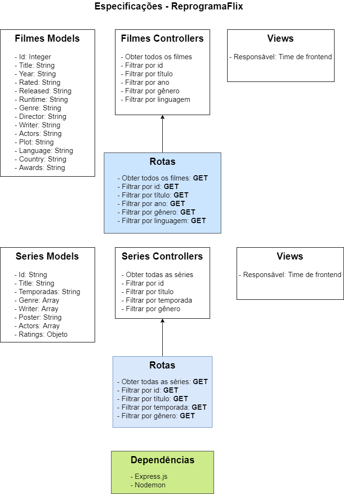

# ReprogramaFlix

O objetivo do projeto é retornar as consultas de filmes e séries, visualizando todos, apenas um, por título, gênero, temporada, linguagem e ano utilizando boas práticas e estrutura de pastas, seguindo o design MVC. 

# Motivação

Aprender os conceitos de GET, um dos métodos HTTP.

# Arquitetura 

# Ferramentas utilizadas

* Nodejs
* Expressjs
* Nodemon

# Configuração do projeto
 
No terminal, digite o comando `npm install` ou simplesmente `npm i` e faça a instalação do projeto. Note que isso criará a pasta `node_modules`.

Para rodar o projeto, digite no terminal o comando `npm start`. Isso iniciará o servidor na rota `http://localhost:8080`.

Feito com ❤️ por Irla Andrade 👋🏽 [Entre em contato!](https://www.linkedin.com/in/irlaandrade/)
